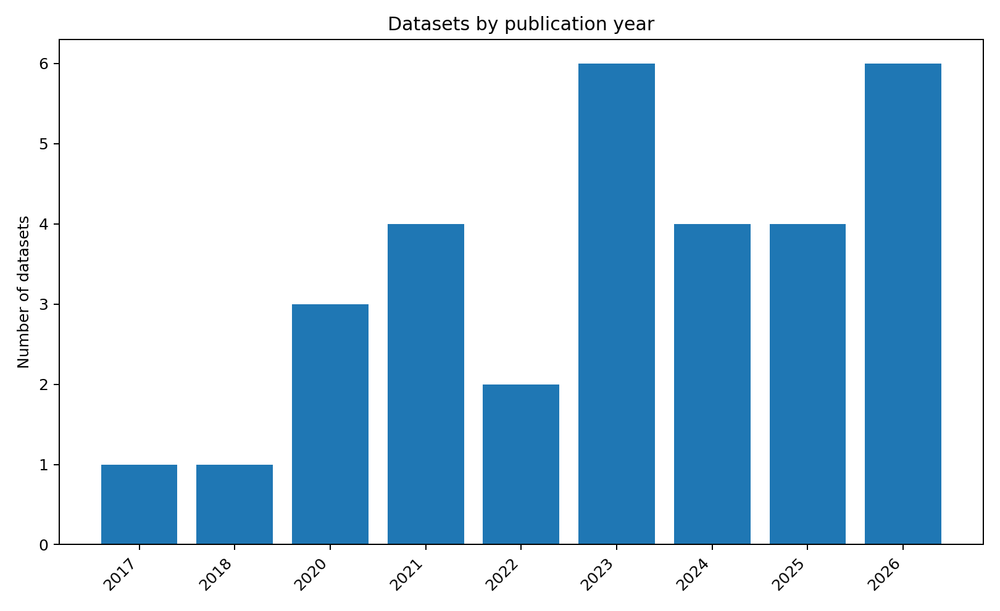
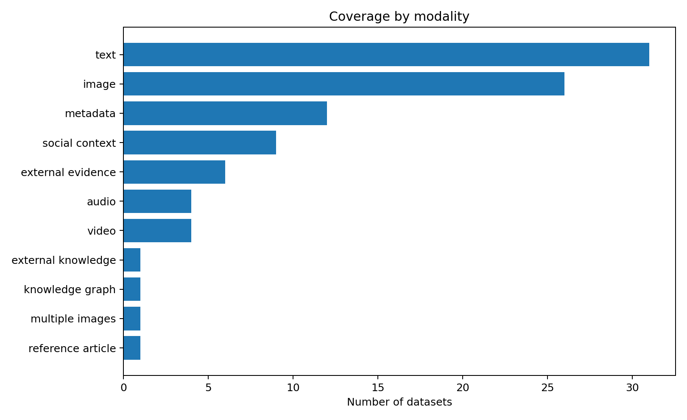
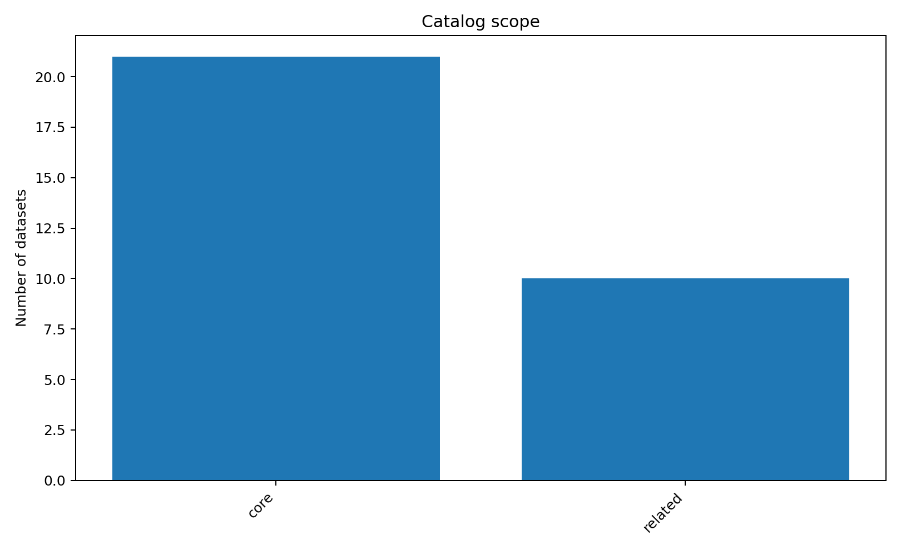
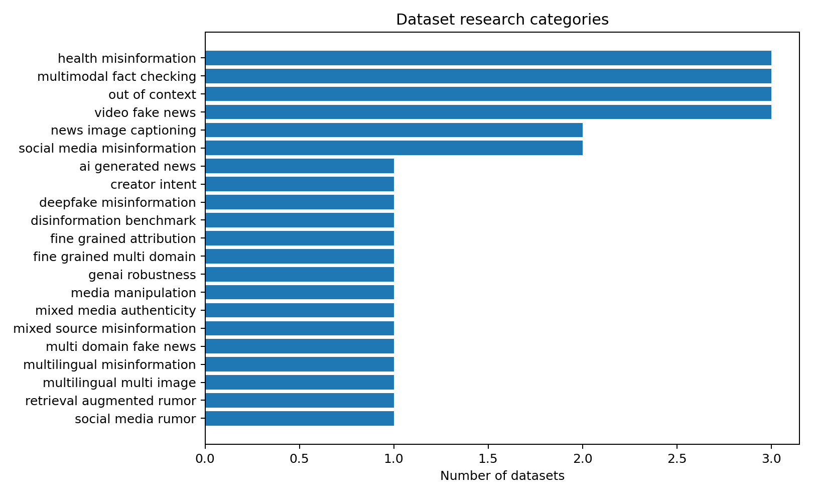

# 📰 Multimodal Fake News Datasets

> A research-oriented collection of **multimodal fake news / misinformation / rumor / disinformation / fact-checking / out-of-context / media manipulation / AI-generated news datasets**.

[](datasets/datasets.csv)
[](#-core-multimodal-fake-news-datasets)
[](#-closely-related-benchmarks)
[](catalog/datasets.yaml)

This collection supports research on **Multimodal Fake News Detection (MFND/MMD)** and related topics. It brings together **papers, official repositories, dataset access links, and structured metadata**—including task, modality, language, domain, label type, and data origin—to make dataset discovery and comparison faster.

---

## ✨ Highlights

- 📚 Currently includes **29 datasets / benchmarks**: **21 core datasets + 8 closely related datasets**.
- 🕰️ Covers classic datasets such as **Fakeddit, FakeNewsNet, Weibo, Weibo21, MuMiN, and FakeSV**.
- 🚀 Continuously includes recent datasets and benchmarks such as **FineFake, AMG, MMFakeBench, MFND, MM-Health, VLDBench, DriftBench, DeceptionDecoded, ReMMDBench, and FakeVE**.
- 🌍 Covers different settings including **multi-domain, multilingual, social context, external evidence / knowledge, fine-grained labels, multi-image, audio-video, and generative AI**.
- 🧩 Distinguishes between **real-world data, curated real-world data, out-of-context construction, synthetic manipulation, mixed real + synthetic data, and GenAI-diversified data**.
- 🗂️ `catalog/datasets.yaml` stores the structured metadata, while `datasets/datasets.csv` can be directly used for statistical analysis.

---

## 🗺️ Start Here

| If you want to… | Start with… |
|---|---|
| Compare the main fake-news datasets | [Core dataset catalog](#-core-multimodal-fake-news-datasets) |
| Filter candidates by research capability | [Dataset feature comparison](#-dataset-feature-comparison) |
| Explore adjacent fact-checking and manipulation benchmarks | [Closely related benchmarks](#-closely-related-benchmarks) |
| Choose data for a specific research question | [Dataset recommendations](#-how-to-choose-a-dataset) |
| Reuse the catalog programmatically | [`catalog/datasets.yaml`](catalog/datasets.yaml) and [`datasets/datasets.csv`](datasets/datasets.csv) |

> **Reading tip:** Use the core catalog for datasets whose primary task is misinformation detection. Use the related catalog when studying a neighboring task such as out-of-context detection, fact-checking, or media-manipulation localization.

---

## 🧭 Quick Navigation

- [📚 Core Multimodal Fake News Datasets](#-core-multimodal-fake-news-datasets)
- [✅ Dataset Feature Comparison](#-dataset-feature-comparison)
- [🔗 Closely Related Benchmarks](#-closely-related-benchmarks)
- [📊 Visual Summary](#-visual-summary)
- [🎯 How to Choose a Dataset](#-how-to-choose-a-dataset)
- [🔤 Modality Legend](#-modality-legend)
- [🧱 Dataset Scope](#-dataset-scope)
- [⚠️ Data Origin](#️-data-origin)
- [📁 Repository Structure](#-repository-structure)
- [📎 Dataset Link Policy](#-dataset-link-policy)

---

## 📚 Core Multimodal Fake News Datasets

The following datasets directly support fake news, misinformation, rumor, disinformation, fine-grained attribution, or short-video fake-news detection.

> **Link legend:** `📄` paper · `💻` official repository or project page · `📦` dataset access
> To keep the table readable on GitHub, access details and more complete metadata are stored in [`datasets/datasets.csv`](datasets/datasets.csv) and [`catalog/datasets.yaml`](catalog/datasets.yaml).

| Dataset | Year | Language | Main Setting | Modalities | Labels / Task | Scale |
|---|---:|---|---|---|---|---:|
| **DeceptionDecoded**<br>[📄](https://github.com/jiayingwu19/DeceptionDecoded) [💻](https://github.com/jiayingwu19/DeceptionDecoded) [📦](https://github.com/jiayingwu19/DeceptionDecoded) | 2026 · ICLR | EN | Creator intent / deception intent | `T+I+R` | Intent-centric multi-task / misleading intent detection | 12,000 |
| **DriftBench**<br>[📄](https://ojs.aaai.org/index.php/AAAI/article/view/37023) [💻](https://github.com/fanxiao15/DriftBench) [📦](https://github.com/fanxiao15/DriftBench) | 2026 · AAAI | EN | GenAI robustness | `T+I+E` | Truth verification + 6 diversification categories | 16,000 |
| **FakeVE**<br>[📄](https://doi.org/10.1016/j.ipm.2026.104769) [💻](https://github.com/Lieberk/FakeVE) [📦](https://github.com/Lieberk/FakeVE) | 2026 · IP&M | EN | Video fake news | `V+A+T` | Explainable fake-news video detection | 2,672 |
| **FineFake**<br>[📄](https://doi.org/10.1016/j.inffus.2026.104253) [💻](https://github.com/Accuser907/FineFake) [📦](https://github.com/Accuser907/FineFake) | 2026 · Information Fusion | EN | Fine-grained / multi-domain | `T+I+S+M+K` | Binary + 6-way fine-grained | 16,909 |
| **ReMMDBench**<br>[📄](https://arxiv.org/abs/2606.24112) [💻](https://dang-ai.github.io/ReMMD) [📦](https://dang-ai.github.io/ReMMD) | 2026 | Multilingual | Multilingual / multi-image / evidence verification | `T+MI+E` | 5-way veracity + 8 distortion labels | 500 |
| **VLDBench**<br>[📄](https://doi.org/10.1016/j.inffus.2025.104092) [💻](https://github.com/VectorInstitute/VLDBench) [📦](https://github.com/VectorInstitute/VLDBench) | 2026 · Information Fusion | EN | Multi-category disinformation | `T+I` | 13 benchmark-specific categories | ≈62K |
| **AMG**<br>[📄](https://ojs.aaai.org/index.php/AAAI/article/view/31999) [💻](https://github.com/mazihan880/AMG-An-Attributing-Multi-modal-Fake-News-Dataset) [📦](https://github.com/mazihan880/AMG-An-Attributing-Multi-modal-Fake-News-Dataset) | 2025 · AAAI | ZH | Fine-grained fake-news attribution | `T+I` | 6-way classification / attribution | 4,922 |
| **MFND**<br>[📄](https://www.ijcai.org/proceedings/2025/891) [💻](https://github.com/yunan-wang33/sdml) [📦](https://github.com/yunan-wang33/sdml) | 2025 · IJCAI | EN | Multimodal manipulation | `T+I` | 11 manipulation types + localization | — |
| **MM-Health**<br>[📄](https://aclanthology.org/2025.findings-emnlp.1316/) [💻](https://github.com/grantzyr/MM-Health-Dataset) [📦](https://huggingface.co/datasets/zzha6204/MM-Health) | 2025 · EMNLP Findings | EN | Health misinformation / AI generation | `T+I` | Reliability + originality + fine-grained labels | 34,746 |
| **MMFakeBench**<br>[📄](https://proceedings.iclr.cc/paper_files/paper/2025/hash/d6c53fe062716387ff0df73cc53de60c-Abstract-Conference.html) [💻](https://github.com/liuxuannan/MMFakeBench) [📦](https://huggingface.co/datasets/liuxuannan/MMFakeBench) | 2025 · ICLR | EN | Mixed-source misinformation | `T+I` | Binary + 3 coarse classes + 12 subtypes | 11,000 |
| **FakeTT**<br>[📄](https://dl.acm.org/doi/10.1145/3664647.3680663) [💻](https://github.com/ICTMCG/FakingRecipe) [📦](https://github.com/ICTMCG/FakingRecipe) | 2024 · ACM MM | EN | Short-video fake news | `V+A+T` | Binary classification | 1,991 |
| **M³A**<br>[📄](https://doi.org/10.1016/j.cviu.2024.104205) [💻](https://github.com/FinalYou/M3A) [📦](https://github.com/FinalYou/M3A#data-repository) | 2024 · CVIU | Global | Multimedia authenticity | `T+I+A+V` | Fine-grained / multi-task | — |
| **FakeSV**<br>[📄](https://ojs.aaai.org/index.php/AAAI/article/view/26689) [💻](https://github.com/ICTMCG/FakeSV) [📦](https://github.com/ICTMCG/FakeSV#application-for-data-use) | 2023 · AAAI | ZH | Short-video fake news | `V+A+T+S+M` | Binary + debunking information | 5,538 |
| **MR²**<br>[📄](https://doi.org/10.1145/3539618.3591896) [💻](https://github.com/THU-BPM/MR2) [📦](https://github.com/THU-BPM/MR2) | 2023 · SIGIR | EN / ZH | Retrieval-augmented rumor detection | `T+I+S+M+E` | 3-way classification | 14,700 |
| **MuMiN**<br>[📄](https://dl.acm.org/doi/10.1145/3477495.3531744) [💻](https://github.com/MuMiN-dataset/mumin-build) [📦](https://mumin-dataset.github.io/getting_started/) | 2022 · SIGIR | 41 languages | Multilingual misinformation | `T+I+S+M+G` | Binary classification | 12,914 claims |
| **CHECKED**<br>[📄](https://pmc.ncbi.nlm.nih.gov/articles/PMC8217979/) [💻](https://github.com/cyang03/CHECKED) [📦](https://github.com/cyang03/CHECKED) | 2021 · SNAM | ZH | COVID-19 / health | `T+I+S+M` | Binary classification | 2,104 |
| **Weibo21**<br>[📄](https://dl.acm.org/doi/10.1145/3459637.3482139) [💻](https://github.com/kennqiang/MDFEND-Weibo21) [📦](https://github.com/kennqiang/MDFEND-Weibo21) | 2021 · CIKM | ZH | Multi-domain fake news | `T+I+M` | Binary classification | 9,128 |
| **Fakeddit**<br>[📄](https://aclanthology.org/2020.lrec-1.755/) [💻](https://github.com/entitize/Fakeddit) [📦](https://github.com/entitize/Fakeddit#download) | 2020 · LREC | EN | Social media | `T+I+S+M` | 2 / 3 / 6-way classification | 1,063,106 |
| **MM-COVID**<br>[📄](https://arxiv.org/abs/2011.04088) [💻](https://github.com/bigheiniu/MM-COVID) [📦](https://zenodo.org/records/4444557) | 2020 · IEEE BigData | 6 languages | COVID-19 / cross-lingual | `T+S+M` | Binary classification | 11,173 |
| **FakeNewsNet**<br>[📄](https://arxiv.org/abs/1809.01286) [💻](https://github.com/KaiDMML/FakeNewsNet) [📦](https://github.com/KaiDMML/FakeNewsNet/tree/master/dataset) | 2018 | EN | News + social propagation | `T+I+S+M` | Binary classification | — |
| **Weibo Multimodal Rumor Dataset**<br>[📄](https://doi.org/10.1145/3123266.3123454) [💻](https://github.com/wangzhuang1911/Weibo-dataset) [📦](https://github.com/wangzhuang1911/Weibo-dataset) | 2017 · ACM MM | ZH | Weibo rumor detection | `T+I+S+M` | Binary classification | 9,528 |

---

## ✅ Dataset Feature Comparison

This table provides a quick overview of the major differences among the core datasets.
`✅` indicates that the feature is an important part of the dataset or an explicitly supported research setting, while `—` means it is not a primary feature.

| Dataset | Multi-domain | Multilingual | Social Context | External Evidence / Knowledge | Fine-grained Labels | Generated / Synthetic Data | Audio-Video / Multi-image |
|---|:---:|:---:|:---:|:---:|:---:|:---:|:---:|
| DeceptionDecoded | — | — | — | ✅ | ✅ | ✅ | — |
| DriftBench | ✅ | — | — | ✅ | ✅ | ✅ | — |
| FakeVE | ✅ | — | — | — | ✅ | — | ✅ |
| FineFake | ✅ | — | ✅ | ✅ | ✅ | — | — |
| ReMMDBench | ✅ | ✅ | — | ✅ | ✅ | — | ✅ |
| VLDBench | ✅ | — | — | — | ✅ | — | — |
| AMG | ✅ | — | — | — | ✅ | — | — |
| MFND | — | — | — | — | ✅ | ✅ | — |
| MM-Health | — | — | — | — | ✅ | ✅ | — |
| MMFakeBench | ✅ | — | — | — | ✅ | ✅ | — |
| FakeTT | ✅ | — | — | — | — | — | ✅ |
| M³A | ✅ | — | — | — | ✅ | ✅ | ✅ |
| FakeSV | — | — | ✅ | — | — | — | ✅ |
| MR² | ✅ | ✅ | ✅ | ✅ | ✅ | — | — |
| MuMiN | ✅ | ✅ | ✅ | ✅ | — | — | — |
| CHECKED | — | — | ✅ | — | — | — | — |
| Weibo21 | ✅ | — | — | — | — | — | — |
| Fakeddit | — | — | ✅ | — | ✅ | — | — |
| MM-COVID | — | ✅ | ✅ | — | — | — | — |
| FakeNewsNet | ✅ | — | ✅ | — | — | — | — |
| Weibo Multimodal Rumor | — | — | ✅ | — | — | — | — |

> **Note:** This table is intended as a quick overview and does not replace the complete dataset definitions in the original papers. Some datasets support multiple tasks; more detailed metadata is available in [`catalog/datasets.yaml`](catalog/datasets.yaml).

---

## 🔗 Closely Related Benchmarks

The following datasets are highly relevant to multimodal fake-news research but mainly focus on adjacent tasks, such as **out-of-context detection, fact-checking, media-manipulation localization, or AI-generated-content detection**.

| Dataset | Year | Main Focus | Modalities | Labels / Task | Scale |
|---|---:|---|---|---|---:|
| **MiRAGeNews**<br>[📄](https://aclanthology.org/2024.findings-emnlp.959/) [💻](https://github.com/nosna/miragenews) [📦](https://huggingface.co/datasets/anson-huang/mirage-news) | 2024 · EMNLP Findings | AI-generated news | `T+I` | Real vs AI-generated | 15,000 |
| **VERITE**<br>[📄](https://link.springer.com/article/10.1007/s13735-023-00317-5) [💻](https://github.com/stevejpapad/image-text-verification) [📦](https://github.com/stevejpapad/image-text-verification) | 2024 · IJMIR | Out-of-context misinformation | `T+I` | 3-way classification | 1,000 |
| **COSMOS**<br>[📄](https://ojs.aaai.org/index.php/AAAI/article/view/26739) [💻](https://github.com/shivangi-aneja/COSMOS) [📦](https://github.com/shivangi-aneja/COSMOS#dataset) | 2023 · AAAI | OOC detection | `T+I` | Binary classification | 204,458 images |
| **DGM⁴**<br>[📄](https://openaccess.thecvf.com/content/CVPR2023/html/Shao_Detecting_and_Grounding_Multi-Modal_Media_Manipulation_CVPR_2023_paper.html) [💻](https://github.com/hsrr/DGM4) [📦](https://github.com/hsrr/DGM4) | 2023 · CVPR | Multimodal media manipulation | `T+I` | Detection + localization | 230,000 |
| **FACTIFY 2**<br>[📄](https://arxiv.org/abs/2304.03897) [💻](https://github.com/surya1701/Factify-2.0) [📦](https://defactify.com/2023/factify.html) | 2023 | Multimodal fact-checking | `T+I+E` | 5-way classification | 50,000 |
| **MOCHEG**<br>[📄](https://doi.org/10.1145/3539618.3591879) [💻](https://github.com/VT-NLP/Mocheg) [📦](https://github.com/VT-NLP/Mocheg) | 2023 · SIGIR | Fact-checking + explanation | `T+I+E` | Verification + explanation generation | — |
| **FACTIFY**<br>[📄](https://www.semanticscholar.org/paper/FACTIFY%3A-A-Multi-Modal-Fact-Verification-Dataset-Mishra-Suryavardan/c0532d8d69af3bc0836b88c5aae2ce6166ac5136) [💻](https://github.com/Shreyashm16/Factify) [📦](https://github.com/Shreyashm16/Factify) | 2022 | Multimodal fact-checking | `T+I+E` | 3-way classification | 50,000 |
| **NewsCLIPpings**<br>[📄](https://aclanthology.org/2021.emnlp-main.545/) [💻](https://github.com/g-luo/news_clippings) [📦](https://github.com/g-luo/news_clippings#data) | 2021 · EMNLP | OOC image-text mismatch | `T+I` | Binary classification | 988,283 |

---

## 📊 Visual Summary

These figures summarize the full catalog and complement, rather than replace, the dataset-level metadata above.

### 📅 Datasets by Publication Year



### 🧩 Modality Coverage



### 📚 Core / Related Distribution



### 🔍 Research Category Distribution



---

## 🎯 How to Choose a Dataset

Use this table as a first-pass shortlist, then verify licensing, access requirements, and task definitions on each dataset's official page.

| Research Direction | Recommended Datasets |
|---|---|
| 🖼️ Classic image-text fake news detection | **Fakeddit, Weibo, Weibo21** |
| 🌐 Social propagation / social context | **FakeNewsNet, MuMiN, CHECKED, MR²** |
| 🔬 Fine-grained fake type / attribution | **FineFake, AMG, MMFakeBench, MFND** |
| 🧭 Multi-domain generalization | **FineFake, Weibo21, M³A, VLDBench** |
| 🧩 Out-of-context image-text misinformation | **COSMOS, NewsCLIPpings, VERITE** |
| 🔎 External evidence / retrieval-augmented verification | **MR², MOCHEG, FACTIFY, FineFake, ReMMDBench** |
| 🤖 Robustness in the GenAI era | **MMFakeBench, MM-Health, VLDBench, DriftBench, DeceptionDecoded** |
| ✨ AI-generated multimodal news | **MiRAGeNews, MM-Health** |
| 🎬 Short-video fake news | **FakeSV, FakeTT, FakeVE** |
| 🌍 Multilingual / cross-lingual | **MM-COVID, MuMiN, MR², ReMMDBench** |
| 🖼️🖼️ Multi-image verification | **ReMMDBench** |

---

## 🔤 Modality Legend

| Abbreviation | Meaning | Abbreviation | Meaning |
|:---:|---|:---:|---|
| `T` | Text | `I` | Image |
| `MI` | Multiple Images | `V` | Video |
| `A` | Audio | `S` | Social Context |
| `M` | Metadata | `E` | External Evidence |
| `K` | External Knowledge | `G` | Knowledge Graph |
| `R` | Reference Article |  |  |

---

## 🧱 Dataset Scope

### 📌 Core

Datasets directly designed for **multimodal fake news / misinformation / rumor / disinformation detection**, including:

- Image-text fake news detection
- Multi-domain / multilingual detection
- Fine-grained fake type and attribution
- Social-context modeling
- Short-video fake news detection
- Fake-news detection and robustness evaluation in GenAI settings

### 🔗 Related

Datasets that are highly relevant to multimodal fake news research but mainly target adjacent tasks, such as:

- Out-of-Context (OOC) detection
- Multimodal fact-checking
- Media manipulation detection and localization
- AI-generated news detection
- Evidence retrieval and explanation generation

Separating these two groups makes it easier to distinguish their research objectives and evaluation settings.

---

## ⚠️ Data Origin

The way "fake" or misleading content is created varies substantially across datasets. This distinction is important when comparing model performance.

| Type | Description |
|---|---|
| `real_world` | Naturally occurring misinformation from news websites, social media, or short-video platforms |
| `real_world_curated` | Real-world samples that are selected, curated, or manually verified for benchmark construction |
| `synthetic_pairing` | Real images, captions, or text are recombined to create out-of-context samples |
| `synthetic_manipulation` | Images or text are modified through controlled manipulation |
| `mixed_real_and_synthetic` | Combines real-world data with generated or manipulated samples |
| `genai_diversified` | Uses generative AI to rewrite, diversify, or regenerate news content |

> When comparing results across datasets, consider **data origin, task definition, label granularity, and modality settings** rather than accuracy alone.

---

## 📁 Repository Structure

```text
.
├── README.md
├── CONTRIBUTING.md
├── CITATION.cff
├── requirements.txt
├── catalog/
│   └── datasets.yaml
├── datasets/
│   └── datasets.csv
├── analysis/
│   ├── summary.json
│   ├── datasets_by_year.png
│   ├── modalities.png
│   ├── scope.png
│   └── categories.png
├── docs/
│   ├── METADATA_SCHEMA.md
│   └── SOURCES.md
└── scripts/
    └── build_assets.py
```

---

## 📎 Dataset Link Policy

This repository is mainly used to **collect and summarize dataset papers, official repositories, and dataset access links**. Original dataset files are not re-uploaded or redistributed here.

For download procedures, application requirements, and usage restrictions, please refer to the official page of each dataset.

---

## ⭐ Acknowledgement

If this collection is useful for your research, a **Star ⭐** is greatly appreciated.
